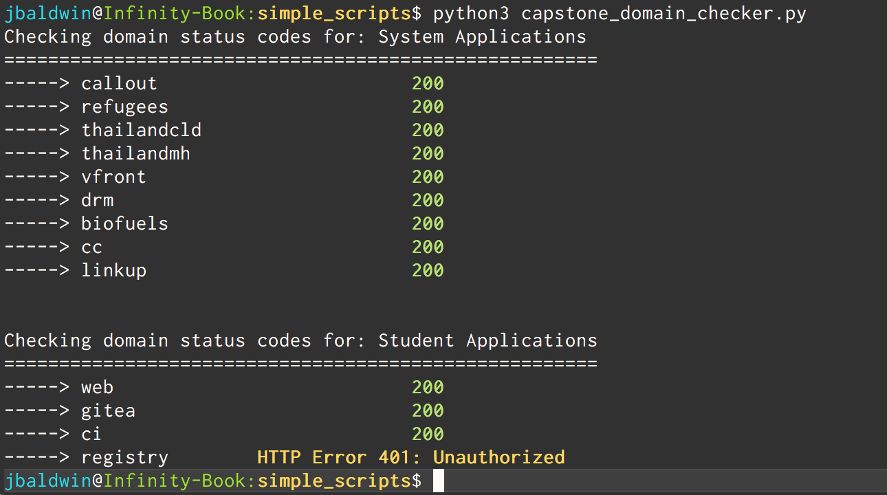

# Site-checker script
-----------------
### What
Simple script that pings the given sites and returns their http return code. 
* Allowing you to quickly see if all the applications are still running.
### How
* Edit the arrays with a list of subdomains
* Edit the domain constant as well
* **run the script**
```
$ python3 capstone-domain-checker.py
```

#### Example good output:


#### TODO:
 - Add in a better way of choosing sites to ping, subdomain/domain entry
 - Throw it onto a webpage and host on AWS Lambda
